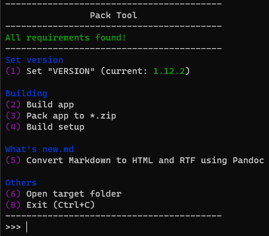

# Build process

- [Build process](#build-process)
  - [Manual build process](#manual-build-process)
    - [Requirements](#requirements)
    - [Building the application manually](#building-the-application-manually)
    - [Building the setup manually](#building-the-setup-manually)
  - [Use my build script `pack_tool.py`](#use-my-build-script-pack_toolpy)
    - [Requirements](#requirements-1)
    - [Running the script](#running-the-script)

## Manual build process

### Requirements
- Windows 10 or later
- [Visual Studio 2022 Community edition](https://visualstudio.microsoft.com/vs/community/)
    - [".NET Desktop Development" workload installed](https://learn.microsoft.com/en-us/visualstudio/install/modify-visual-studio?view=vs-2022)
- [Inno Setup](https://jrsoftware.org/isdl.php) (optional, needed to build the installer)

### Building the application manually
1. Open the solution `Fallout76-QuickConfiguration\Fo76ini\Fo76ini.sln` in Visual Studio 2022.
2. Set the build target to "Release", "Any CPU", and "Fo76ini_Updater"
3. Click Build → Build Solution (F6)
4. Copy (and replace) the content of `Fallout76-QuickConfiguration\Fo76ini_Updater\bin\Release\` into  `Fallout76-QuickConfiguration\Fo76ini\bin\Release\`. (Create the latter directory, if it does not exist)
5. Next, set the build target to "Release", "Any CPU", and "Fo76ini"
6. Once again, click Build → Build Solution (F6)
7. Copy the content of `Fallout76-QuickConfiguration\Additional files\` into `Fallout76-QuickConfiguration\Fo76ini\bin\Release\`
8. Done.

### Building the setup manually
1. Open `Fallout76-QuickConfiguration\setup.iss` in Inno Setup Compiler.
2. Edit the first few lines, such as `ProjectVersion` and `ProjectGitDir`
3. You'll probably also need to edit these lines:
    ```
    [Files]
    Source: "{#ProjectGitDir}\Publish\v{#ProjectVersion}\Fo76ini.exe"; DestDir: "{app}"; Flags: ignoreversion
    Source: "{#ProjectGitDir}\Publish\v{#ProjectVersion}\*"; DestDir: "{app}"; Flags: ignoreversion recursesubdirs createallsubdirs
    ; NOTE: Don't use "Flags: ignoreversion" on any shared system files
    ```
    to something like this:
    ```
    [Files]
    Source: "{#ProjectGitDir}\Fo76ini\bin\Release\Fo76ini.exe"; DestDir: "{app}"; Flags: ignoreversion
    Source: "{#ProjectGitDir}\Fo76ini\bin\Release\*"; DestDir: "{app}"; Flags: ignoreversion recursesubdirs createallsubdirs
    ; NOTE: Don't use "Flags: ignoreversion" on any shared system files
    ```
4. Build the setup.

## Use my build script `pack_tool.py`

### Requirements
First, install all requirements from the "Manual build process" section.

I recommend installing all additional requirements for this build script using scoop:
```powershell
Set-ExecutionPolicy RemoteSigned -Scope CurrentUser
irm get.scoop.sh | iex
scoop bucket add extras
scoop install 7zip git python rcedit inno-setup pandoc
python -m pip install colorama
```
*(Paste this line by line into a PowerShell window)*

### Running the script
When you open a terminal in the folder containing the script and run `python pack_tool.py`, you should see something like this:


From here, you can simply build the app and it should put the result into the folder `Publish`.