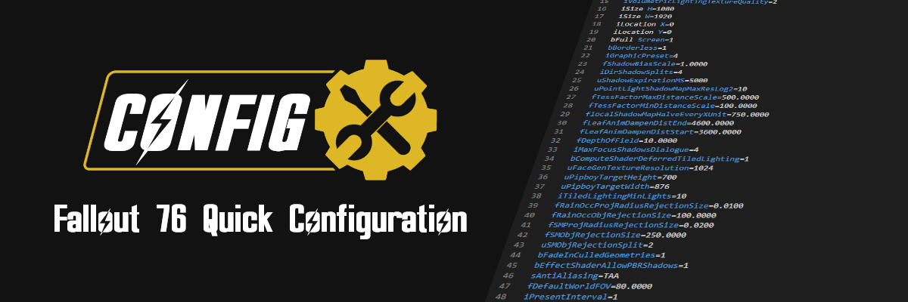
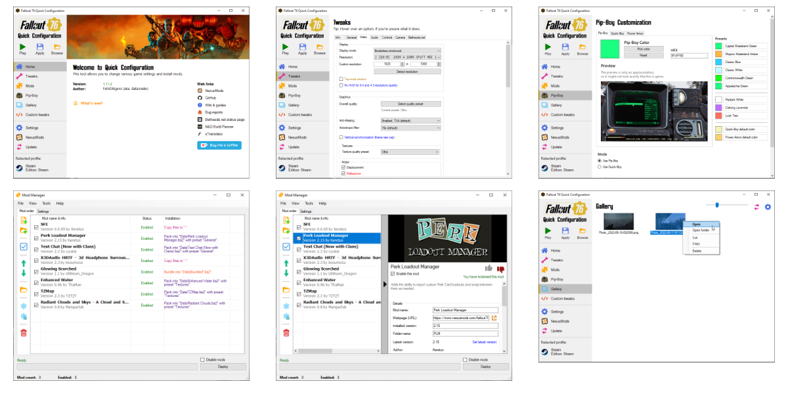

<h3 align="center">
  Tired of searching through the web for *.ini tweaks, and installing mods single-handedly?
</h3>

  This tool allows you to change various game settings and install mods.

  

  
  

  <a href="https://www.nexusmods.com/fallout76/mods/546?tab=images#list-modimages-1">Screenshots</a> |
  <a href="https://github.com/FelisDiligens/Fallout76-QuickConfiguration/wiki">Wiki & Guides</a> |
  <a href="https://www.nexusmods.com/fallout76/mods/546?tab=posts#comment-container">Posts</a> |
  <a href="https://www.nexusmods.com/fallout76/mods/546?tab=bugs#tab-modbugs">Bugs</a>

 

  
  
  
  <!---->

 

## Screenshots

## Features
### *.ini tweaks
- Change display, graphics, volume, audio, interface, and voice chat settings.
- Disable VSync (frame rate cap).
- Change your FOV.
- Mouse sensitivity fix for ALL aspect ratios.

### Pip-Boy customization
- Change the color and resolution of your Pip-Boy and Quick-Boy.
- Use color presets from previous Fallout games.
- See a preview of how the color will look in the game.

### Mod manager
- Install and manage mods.
- Check if a mod has an update. (Requires you to login to NexusMods)

### Gallery
- Access all your screenshots and photos from the gallery.

## Requirements
This program is running on .NET Framework 4.7.2\
It should be **preinstalled on Windows 10.**\
If you can't start the tool, you may have to install it manually: [.NET Framework 4.7.2 web installer](https://dotnet.microsoft.com/download/dotnet-framework/net472)

Archive2 needs [Visual C++ Redistributable for Visual Studio 2012 Update 4](https://www.microsoft.com/en-us/download/details.aspx?id=30679).\
This **might** be preinstalled on your system as well. If your mods aren't deploying properly, try to install it.

If you're still on Windows 7, make sure that you have Service Pack 1 and all updates installed.\
Otherwise the .NET installer might fail or the tool might not start.

## Installation
1. [Download](https://github.com/FelisDiligens/Fallout76-QuickConfiguration/releases/latest) and unzip.
2. Run and set the game edition and path in the Welcome screen.
3. Tweak to your heart's content.
4. Don't forget to hit "Apply".

## Wikis & Guides
* [Frequently Asked Questions](https://github.com/FelisDiligens/Fallout76-QuickConfiguration/wiki/Frequently-Asked-Questions-(FAQ))
* [Troubleshooting](https://github.com/FelisDiligens/Fallout76-QuickConfiguration/wiki/Troubleshooting)
* [Mod Manager Guide](https://github.com/FelisDiligens/Fallout76-QuickConfiguration/wiki/Mod-Manager-Guide)

## Kudos
### These were/are valuable resources:
* [Bilago's Configuraton Tool](https://www.nexusmods.com/fallout76/mods/38)
* [Cloudy01's Mod Manager](https://www.nexusmods.com/fallout76/mods/221)
* [runew0lf's Pipboy Color Changer](https://www.nexusmods.com/fallout76/mods/152)
* The Step-Project wiki articles for [Skyrim's](https://wiki.step-project.com/Guide:SkyrimPrefs_INI) and [Fallout 4's](https://wiki.step-project.com/Guide:Fallout4Prefs_INI) \*Prefs.ini files.
* [Fafla McDafla's C.G.B.V.P.T.I.T.O.M](https://www.nexusmods.com/fallout76/mods/593)
* u/LinuxVersion's Reddit post: [Obtain all 3017 INI settings with default values...](https://www.reddit.com/r/fo76/comments/p48a25/obtain_all_3017_ini_settings_with_default_values/) | [(very useful spreadsheet)](https://docs.google.com/spreadsheets/d/1DFkbE-_8PXiW0r4DrGQGs-QFJELleIkr-mrQUMxpw7o/edit?usp=sharing)
* u/derpderp3200's Reddit post: ["How to actually disable Depth of Field, and how to go from 20fps to 60fps"](https://www.reddit.com/r/fo76/comments/9u4urf/psa_how_to_actually_disable_depth_of_field_and/)
* Trankquel's forum thread: ["An Analysis of Mouse Input and Related INI Variables"](https://forums.nexusmods.com/index.php?/topic/3401795-an-analysis-of-mouse-input-and-related-ini-variables/)
* DoubleYou's forum thread: ["Sun Shadow Transition INI Settings"](https://forum.step-project.com/topic/9209-sun-shadow-transition-ini-settings/)
* u/Xabraxxis's Reddit post: ["Fallout 76 ini file and performance tweaks with full details on what they do."](https://www.reddit.com/r/fo76/comments/e33hpj/fallout_76_ini_file_and_performance_tweaks_with/)
* Gabi's forum thread: ["Unlock Frame Rate, Change FOV, Skip Intro Video, Unlock Console, 21:9 Support and Remove Mouse Smoothing + Other Fixes"](https://steamcommunity.com/sharedfiles/filedetails/?id=551069501)
* Jolu42's forum thread: ["Fallout76Custom.ini (Make the game look better, run smoother)"](https://steamcommunity.com/app/1151340/discussions/0/2259061617881806276/)
* u/Z0MG_H4X's Reddit post: ["[PC] Useful ini Settings Everyone Should Check Out"](https://www.reddit.com/r/fo76/comments/ai6o3t/pc_useful_ini_settings_everyone_should_check_out/)
* u/Aten_Ra's Reddit post: ["[Guide] How to Run Multiple Instances of ’76 on a single computer."](https://www.reddit.com/r/fo76/comments/cb43a7/guide_how_to_run_multiple_instances_of_76_on_a/)
* u/Doppler5hift's Reddit post: ["Solved: how to run two Fallout 76 characters simultaneously using Steam"](https://www.reddit.com/r/fo76/comments/ues8vv/solved_how_to_run_two_fallout_76_characters/)

### Contributors:
* [QuadroTony](https://www.nexusmods.com/fallout76/users/3166296): A lot of bug reports, and ideas, as well as: bSkipSplash=1 disables the news splash on startup.
* [infinitywulf](https://www.nexusmods.com/fallout76/users/2781727): Changing the color of the power armor PipBoy.
* [Juinchi](https://www.nexusmods.com/fallout76/users/3557603) and [Jolu42](https://www.nexusmods.com/fallout76/users/23655354): TAA sharpening
* [toarullen](https://www.nexusmods.com/users/1975046): bShowCompass
* [Eckserah](https://www.nexusmods.com/users/65898136): A lot of valuable information as well as providing default *.ini values
* [bolbman](https://www.nexusmods.com/users/4382192): PipBoy resolution, Camera tweaks
* [ei8htzer0](https://www.nexusmods.com/fallout76/users/23602379): Login credentials (s76UserName, s76Password)
* [zingmars](https://www.nexusmods.com/fallout76/users/3009582): A lot of bug reports, and ideas.
* [dutem](https://www.nexusmods.com/users/42523000) and [ZeroByDivide](https://www.nexusmods.com/users/11380513): Brought Xbox Game Pass to my attention
* [Deadmano](https://www.nexusmods.com/users/1838494): QoL improvement ideas and "bSteamEnabled=0" tweak.
* [Pacoboyd](https://www.nexusmods.com/fallout76/users/27163): Advice, ideas, and "bAutoSignin=1" tweak. 

### Translators:
* Russian by [Sondju](https://forums.nexusmods.com/index.php?/user/6969601-sondju/)
* Italian for v1.12 by [Roger08](https://forums.nexusmods.com/index.php?/user/39134360-roger08/)
* Japanese for v1.11.3 by [Akamiso0123 (yuutarionn)](https://forums.nexusmods.com/index.php?/user/6598456-yuutarionn/)
* Chinese for v1.11.4 by [SugarBombsRADS (BulaLuka)](https://forums.nexusmods.com/index.php?/user/90175763-bulaluka/)

#### Outdated translations:
* Swedish for v1.5.2 by [Pforga](https://forums.nexusmods.com/index.php?/user/634766-pforga/)
* French for v1.6.2 by Christophe Noret (aka. [kr1ss](https://www.nexusmods.com/fallout76/users/22658164)) and [3z3k3yl](https://forums.nexusmods.com/index.php?/user/26975924-3z3k3yl/)
* Brazilian Portuguese for v1.8.4h1 by [Oruam](https://forums.nexusmods.com/index.php?/user/2944752-oruam/)
* Japanese for v1.9.0h2 by [haiji951753](https://forums.nexusmods.com/index.php?/user/59398041-haiji951753/)
* Polish for v1.9.2 by [Gray770](https://forums.nexusmods.com/index.php?/user/91201958-gray770/)
* Chinese
  * for v1.6.2 by [Broodahood](https://forums.nexusmods.com/index.php?/user/68821693-broodahood/)
  * for v1.8.2 by [micus2048](https://www.nexusmods.com/users/97619783)
  * for v1.9.5 by [ColaNaramon (可乐の魂)](https://forums.nexusmods.com/index.php?/user/91571998-colanaramon/)

## License
> © [MIT](https://github.com/FelisDiligens/Fallout76-QuickConfiguration/blob/master/LICENSE)
